# Assignment 2 - Image Translation and Poisson Blending

## Overview

This repository is Linxuan Sun's implementation of **Assignment 2** of DIP.  
It contains **two projects**:

1. **Pix2Pix Image-to-Image Translation**
2. **Interactive Poisson Image Blending**

The first project focuses on learning a mapping between paired facade images and semantic layouts using a fully convolutional U-Net style network in PyTorch.  
The second project implements an interactive gradient-domain blending system with Gradio, allowing users to select a polygon region from a foreground image and seamlessly blend it into a background image.

---

## Repository Structure

```text
02_DIPwithPyTorch
├── Pix2Pix
│   ├── FCN_network.py
│   ├── README.md
│   ├── checkpoints
│   │   ├── pix2pix_model_best.pth
│   │   ├── pix2pix_model_epoch_10.pth
│   │   ├── pix2pix_model_epoch_20.pth
│   │   ├── pix2pix_model_epoch_30.pth
│   │   ├── pix2pix_model_epoch_40.pth
│   │   ├── pix2pix_model_epoch_50.pth
│   │   ├── pix2pix_model_final.pth
│   │   └── pix2pix_model_latest.pth
│   ├── datasets
│   │   └── facades
│   │       ├── train
│   │       ├── val
│   │       └── test
│   ├── download_facades_dataset.sh
│   ├── facades_dataset.py
│   ├── train.py
│   ├── train_list.txt
│   ├── train_results
│   │   ├── epoch_0
│   │   ├── epoch_5
│   │   ├── epoch_10
│   │   ├── epoch_15
│   │   ├── epoch_20
│   │   ├── epoch_25
│   │   ├── epoch_30
│   │   ├── epoch_35
│   │   ├── epoch_40
│   │   └── epoch_45
│   ├── val_list.txt
│   └── val_results
│       ├── epoch_0
│       ├── epoch_5
│       ├── epoch_10
│       ├── epoch_15
│       ├── epoch_20
│       ├── epoch_25
│       ├── epoch_30
│       ├── epoch_35
│       ├── epoch_40
│       └── epoch_45
├── data_poisson
│   ├── equation
│   │   ├── input_equation.png
│   │   ├── output_equiation.png
│   │   ├── source.png
│   │   └── target.png
│   ├── monolisa
│   │   ├── input_monalisa.png
│   │   ├── output_monalisa.png
│   │   ├── source.png
│   │   └── target.png
│   └── water
│       ├── input_water.png
│       ├── output_water.png
│       ├── source.jpg
│       └── target.jpg
├── run_blending_gradio.py
└── README.md
```

---

## Project 1 - Pix2Pix Image-to-Image Translation

### Introduction

This project implements a paired image-to-image translation pipeline on the **CMP Facades** dataset.  
The model takes one side of the paired image as input and predicts the corresponding target image.

In this implementation:

- `facades_dataset.py` loads concatenated facade image pairs
- `FCN_network.py` defines a U-Net style fully convolutional generator
- `train.py` handles training, validation, checkpoint saving, and visualization

### Model

The generator is implemented in:

```python
Pix2Pix/FCN_network.py
```

It is a U-Net style encoder-decoder architecture with skip connections:

- Downsampling blocks with convolution + batch normalization + LeakyReLU
- Bottleneck layer
- Upsampling blocks with transposed convolution + batch normalization + ReLU
- Skip connections between encoder and decoder
- Final `Tanh()` activation to produce outputs in `[-1, 1]`

### Dataset

Dataset loader:

```python
Pix2Pix/facades_dataset.py
```

The dataset file format is based on paired images:

- left half: input image
- right half: target image

The loader:

- reads image paths from `train_list.txt` and `val_list.txt`
- converts images to tensors
- normalizes them to `[-1, 1]`

### Training

Training script:

```bash
cd Pix2Pix
python train.py
```

Main settings used in `train.py`:

- optimizer: `Adam`
- learning rate: `0.0002`
- betas: `(0.5, 0.999)`
- loss function: `L1Loss`
- batch size: `4`
- number of epochs: `50`

During training:

- checkpoints are saved in `Pix2Pix/checkpoints/`
- training visualizations are saved in `Pix2Pix/train_results/`
- validation visualizations are saved in `Pix2Pix/val_results/`

### Checkpoints

Saved checkpoints include:

- `pix2pix_model_latest.pth`
- `pix2pix_model_best.pth`
- `pix2pix_model_final.pth`
- periodic epoch checkpoints such as:
  - `pix2pix_model_epoch_10.pth`
  - `pix2pix_model_epoch_20.pth`
  - `pix2pix_model_epoch_30.pth`
  - `pix2pix_model_epoch_40.pth`
  - `pix2pix_model_epoch_50.pth`

### Pix2Pix Results

Below are representative saved results from training and validation folders.

#### Training Results

**Epoch 0**

<div align="center">
  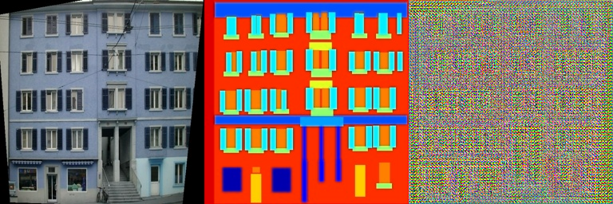
</div>

**Epoch 20**

<div align="center">
  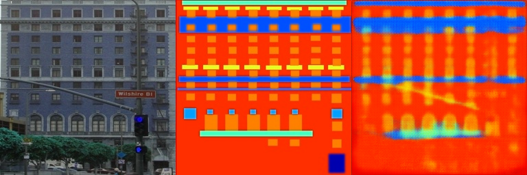
</div>

**Epoch 40**

<div align="center">
  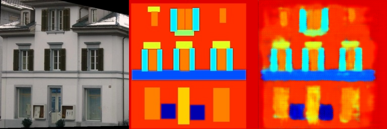
</div>

#### Validation Results

**Epoch 0**

<div align="center">
  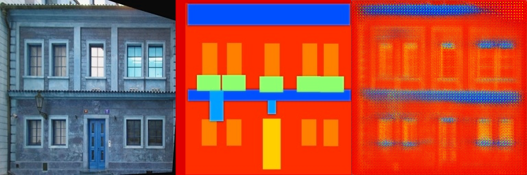
</div>

**Epoch 20**

<div align="center">
  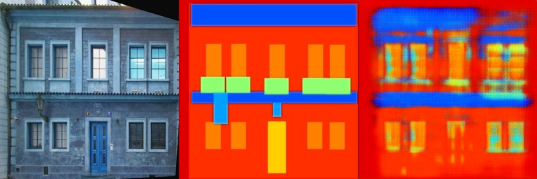
</div>

**Epoch 40**

<div align="center">
  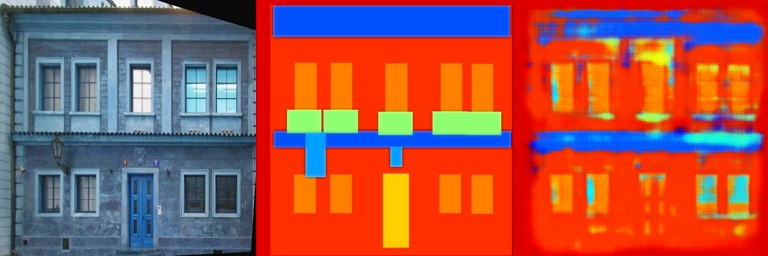
</div>

### Summary of Project 1

This project demonstrates a basic Pix2Pix-style image translation pipeline in PyTorch.  
The saved results in `train_results` and `val_results` show that the model gradually learns the mapping between paired facade images over training epochs.

---

## Project 2 - Interactive Poisson Image Blending

### Introduction

This project implements an interactive Poisson blending system in:

```python
run_blending_gradio.py
```

The application provides a Gradio-based interface where the user can:

1. Upload a foreground image
2. Click to define a polygon region
3. Close the polygon
4. Upload a background image
5. Adjust horizontal and vertical offsets
6. Blend the selected region into the background image

### Main Features

- Interactive polygon selection on the foreground image
- Foreground-to-background placement with `dx` and `dy`
- Polygon visualization on background preview
- Binary mask generation from polygon points
- Local Poisson blending using Jacobi-style iterative updates
- Gradio web interface for easy testing

### Core Logic

The main blending function performs the following steps:

1. Convert the selected polygon into a mask
2. Shift the selected foreground region onto the background coordinate system
3. Crop a local ROI around the selected target region
4. Build the guidance field from the source Laplacian
5. Iteratively solve the blending result with a Jacobi update
6. Replace the ROI in the final background image

This implementation uses:

- `torch`
- `torch.nn.functional`
- `numpy`
- `PIL`
- `gradio`

### Running the Interactive Demo

From the project root directory:

```bash
python run_blending_gradio.py
```

After launching, open the browser at:

```text
http://127.0.0.1:7860
```

### Poisson Blending Results

The repository contains three sample blending cases in `data_poisson/`.

### Example 1 - Mona Lisa

**Source and target**

<div align="center">
  
  
</div>

**Input interface and final output**

<div align="center">
  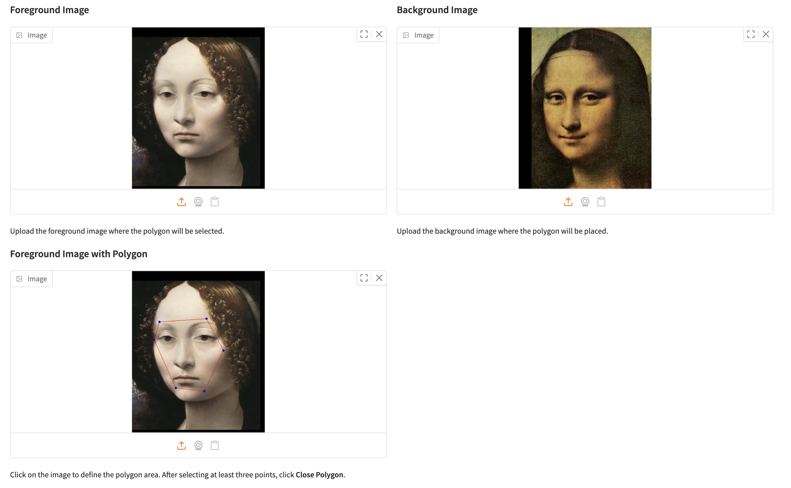
  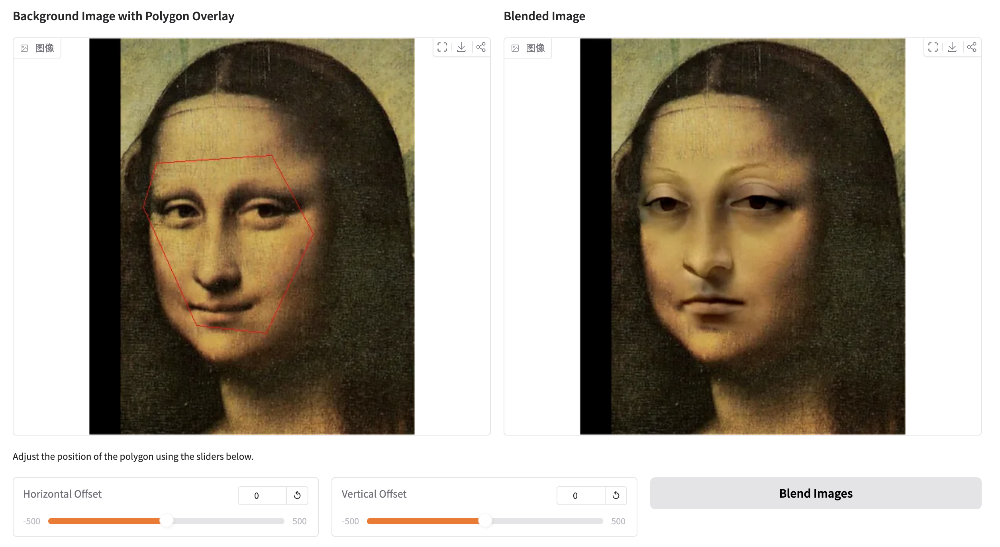
</div>

### Example 2 - Equation

**Source and target**

<div align="center">
  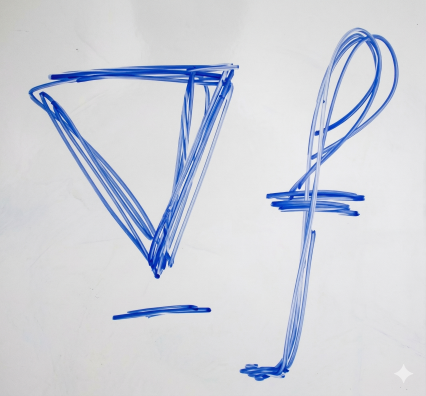
  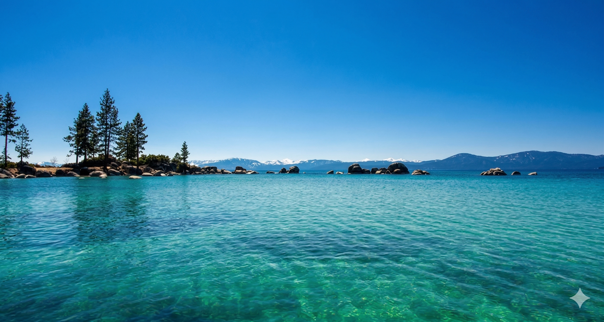
</div>

**Input interface and final output**

<div align="center">
  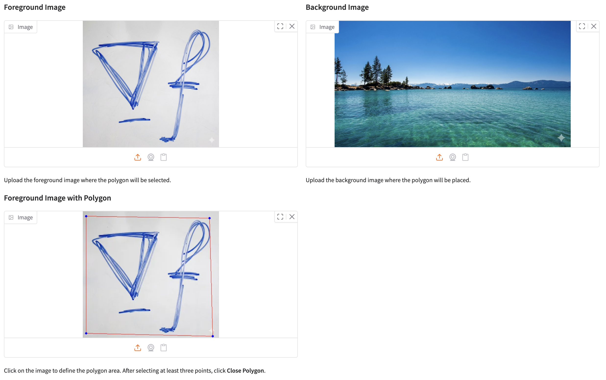
  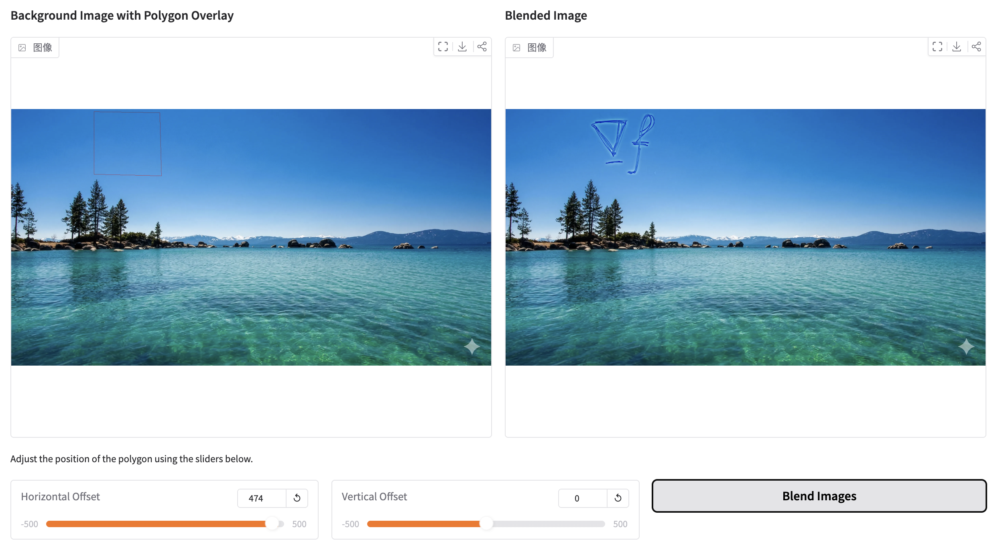
</div>

### Example 3 - Water

**Source and target**

<div align="center">
  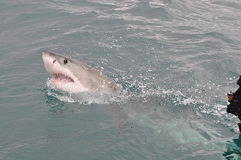
  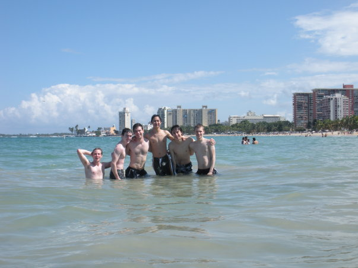
</div>

**Input interface and final output**

<div align="center">
  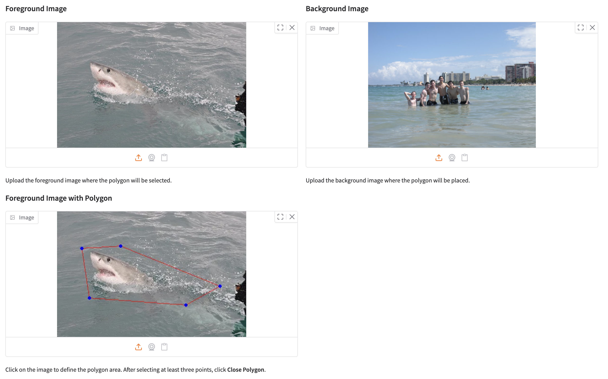
  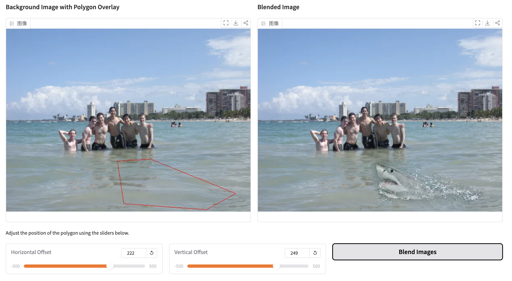
</div>

### Summary of Project 2

This project demonstrates an interactive implementation of gradient-domain image blending.  
By constraining the pasted region with the source Laplacian and preserving the surrounding background boundary, the final composite appears much more natural than simple copy-paste.

---

## Requirements

To install dependencies:

```bash
pip install torch torchvision opencv-python pillow gradio numpy
```

If needed, you may also install dependencies with a virtual environment before running the code.

---

## Running

### Run Pix2Pix Training

```bash
cd Pix2Pix
python train.py
```

### Run Interactive Poisson Blending

```bash
python run_blending_gradio.py
```

---

## Final Remarks

This assignment contains two complementary image processing tasks:

- **Project 1** explores learned image translation with deep neural networks
- **Project 2** explores classical gradient-domain image editing with an interactive interface

Together, they demonstrate both **learning-based** and **optimization-based** approaches for image synthesis and editing.

---

## Acknowledgement

> The Poisson blending part is inspired by the classic paper  
> **Pérez, P., Gangnet, M., & Blake, A. (2003). Poisson image editing.**  
> ACM Transactions on Graphics (TOG), 22(3), 313–318.

> The image-to-image translation part is related to the Pix2Pix framework  
> **Isola, P., Zhu, J. Y., Zhou, T., & Efros, A. A. (2017). Image-to-image translation with conditional adversarial networks.**  
> CVPR.
