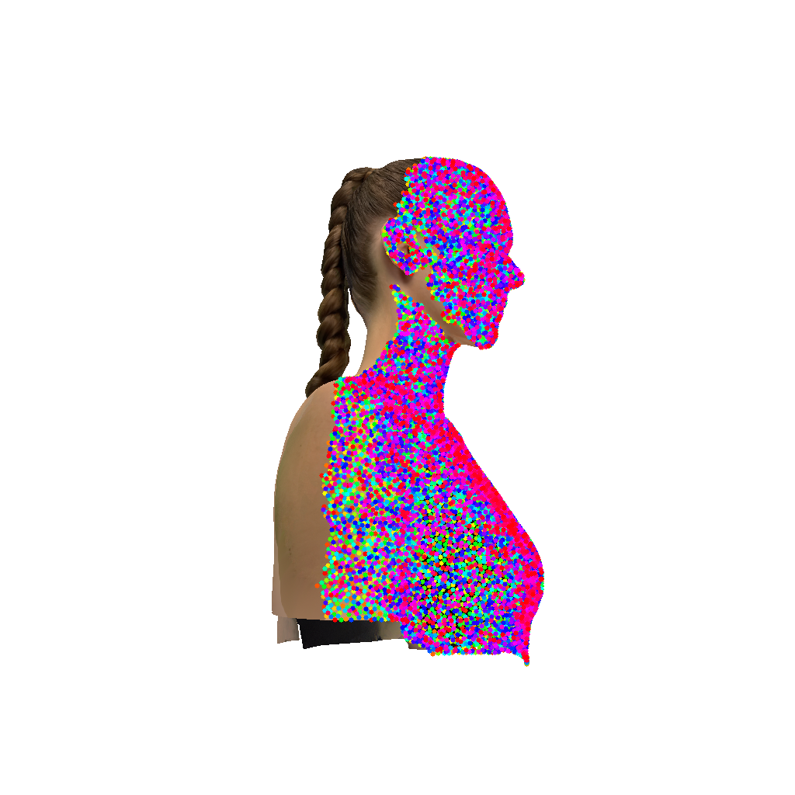
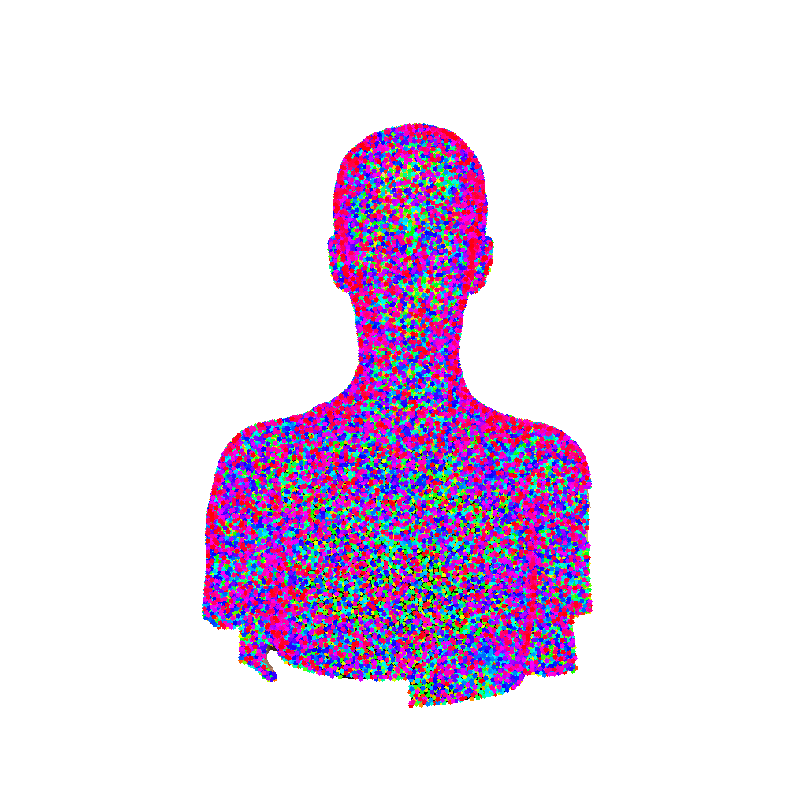
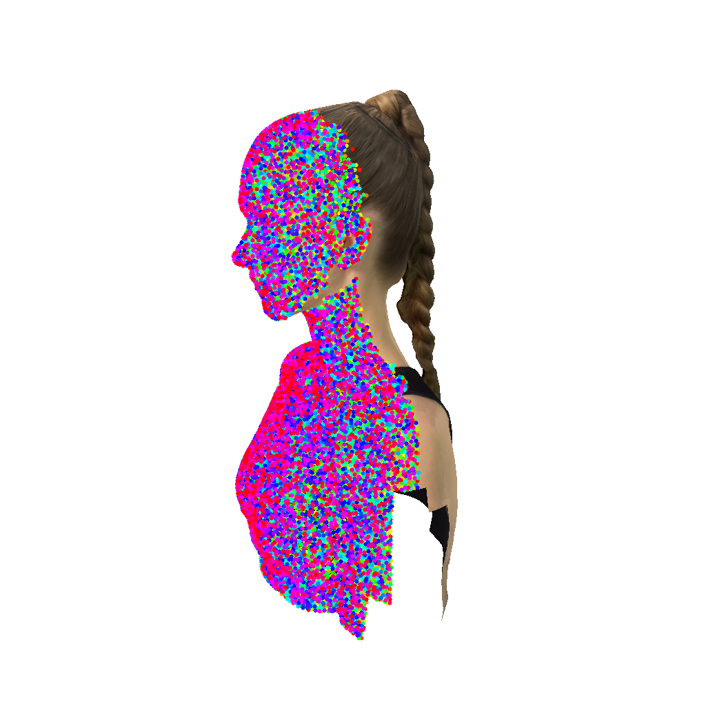
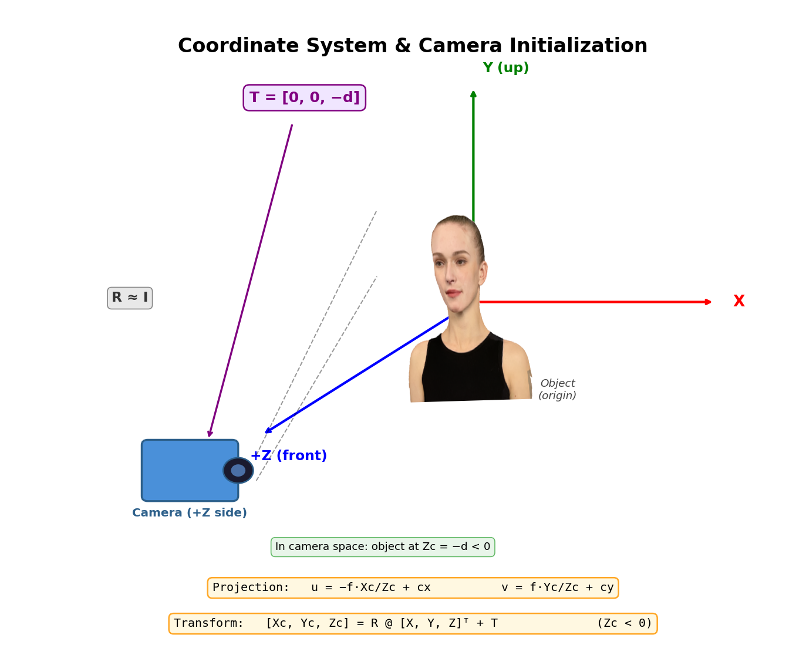
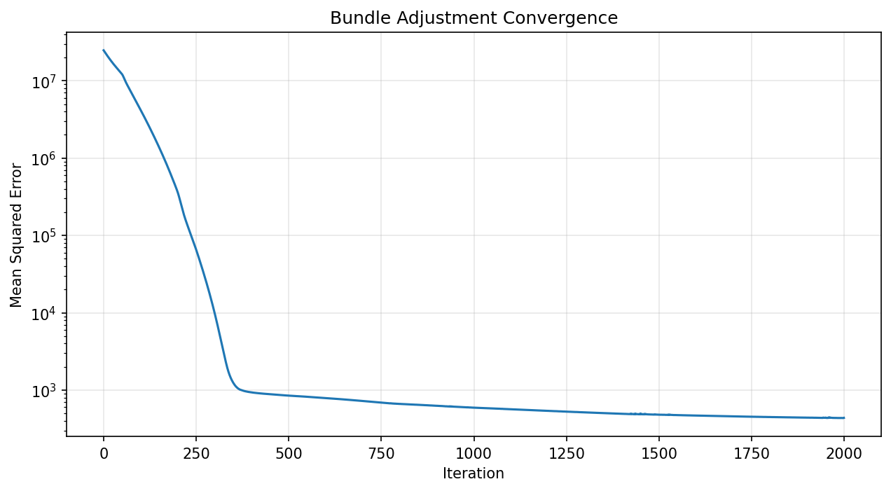
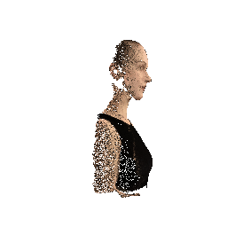
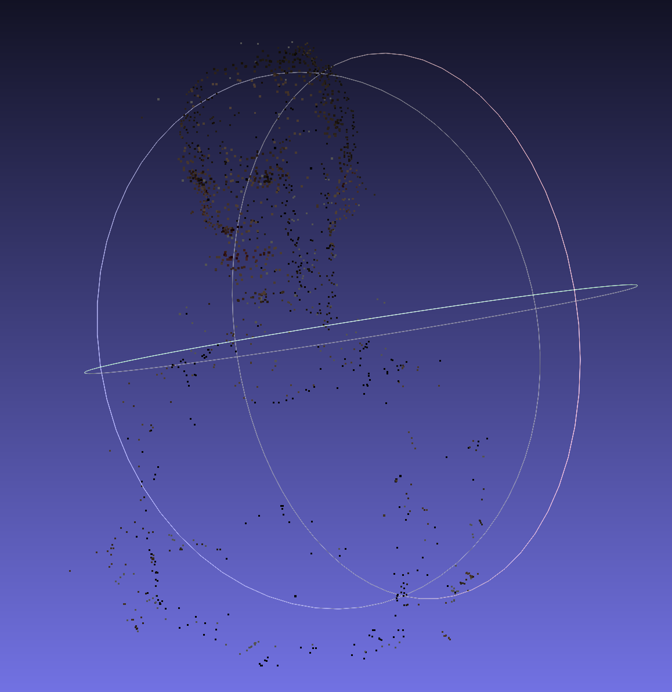

# Assignment 3 - Bundle Adjustment and COLMAP

## Overview

This repository is Kari's implementation of **Assignment 3** of DIP.  
It contains **two tasks**:

1. **Bundle Adjustment Implementation**
2. **COLMAP Sparse Reconstruction**

The first task implements a bundle adjustment optimizer from scratch using PyTorch to jointly optimize camera intrinsics and 3D point positions.  
The second task uses COLMAP to perform feature-based sparse reconstruction on the same dataset.

---

## Project Structure

```text
03_BundleAdjustment
├── README.md
├── bundle_adjustment.py
├── export_colmap.py
├── run_colmap.sh
├── show_colmap_results.py
├── visualize_data.py
├── result.obj
├── colmap_result.obj
├── loss_curve.png
├── colmap_result.png
├── pics
│   ├── coordinate_system.png
│   ├── data_overview.png
│   └── result.gif
└── data
    ├── images
    ├── points2d.npz
    ├── points3d_colors.npy
    ├── vis
    └── colmap
```

---

## Task 1 - Bundle Adjustment

### Introduction

This task implements bundle adjustment optimization to refine camera focal length and 3D point positions.

Given:

- Input images from multiple viewpoints
- Initial 3D points
- 2D pixel observations
- Initial camera intrinsics

The optimizer minimizes reprojection error using gradient-based optimization.

### Data Overview

The input images and projected observations can be visualized as follows:

<div align="center">
  
</div>

Some example overlay visualizations are stored in `data/vis/`:

<div align="center">
  
  
  
</div>

### Coordinate System

The coordinate system used in the assignment is shown below:

<div align="center">
  
</div>

### Implementation

The bundle adjustment is implemented in `bundle_adjustment.py`.

Key components:

- **Projection Model**: Pinhole camera model
- **Optimized Variables**: Camera focal length and 3D point positions
- **Loss Function**: Mean squared reprojection error
- **Optimizer**: Adam optimizer
- **Output Point Cloud**: `result.obj`

### Running Bundle Adjustment

```bash
python bundle_adjustment.py
```

### Results

**Optimization Statistics**

```text
Initial focal length: 640.00 px
Optimized focal length: 640.95 px

Initial RMSE: 50.23 px
Final RMSE: 20.92 px

Number of 3D points: 2000
Output: result.obj
```

**Loss Curve**

<div align="center">
  
</div>

The loss curve shows that the reprojection error decreases during optimization, which indicates that the camera intrinsics and 3D point positions are refined successfully.

**Bundle Adjustment Reconstruction**

The optimized 3D points are saved in:

```text
result.obj
```

The result can be visualized using MeshLab or other 3D point cloud viewers.

A rendered visualization is shown below:

<div align="center">
  
</div>

---

## Task 2 - COLMAP Sparse Reconstruction

### Introduction

This task uses COLMAP to perform automatic sparse reconstruction on the same image set.

The COLMAP pipeline includes:

1. Feature extraction using SIFT
2. Feature matching
3. Sparse reconstruction using Structure from Motion
4. Bundle adjustment refinement
5. Exporting the reconstructed point cloud

### Running COLMAP

```bash
bash run_colmap.sh
```

The sparse reconstruction results are saved in:

```text
data/colmap/sparse/0/
```

This folder contains:

```text
cameras.bin
cameras.txt
images.bin
images.txt
points3D.bin
points3D.txt
project.ini
```

### Exporting COLMAP Result

The COLMAP result can be exported to an OBJ point cloud using:

```bash
python export_colmap.py
```

The exported result is saved as:

```text
colmap_result.obj
```

### Visualizing COLMAP Result

The COLMAP reconstruction can be visualized using:

```bash
python show_colmap_results.py
```

A visualization of the COLMAP sparse reconstruction is shown below:

<div align="center">
  
</div>

The reconstruction can also be opened in COLMAP GUI:

```bash
colmap gui
```

Then import the model from:

```text
data/colmap/sparse/0/
```

---

## Output Files

The main output files are:

```text
result.obj
colmap_result.obj
loss_curve.png
colmap_result.png
pics/result.gif
```

Descriptions:

- `result.obj`: Point cloud produced by the implemented bundle adjustment.
- `colmap_result.obj`: Point cloud exported from COLMAP sparse reconstruction.
- `loss_curve.png`: Reprojection loss curve of the bundle adjustment optimization.
- `colmap_result.png`: Visualization of the COLMAP sparse reconstruction.
- `pics/result.gif`: Rendered visualization of the bundle adjustment result.

---

## Requirements

Install Python dependencies:

```bash
pip install torch numpy matplotlib
```

Install COLMAP:

```bash
brew install colmap
```

Or download COLMAP from:

```text
https://colmap.github.io/
```

---

## Summary

This assignment demonstrates two approaches to 3D reconstruction:

- **Task 1** implements bundle adjustment from scratch using gradient-based optimization.
- **Task 2** uses COLMAP's feature-based Structure from Motion pipeline.

The implemented bundle adjustment optimizes camera parameters and 3D point positions by minimizing reprojection error.  
COLMAP provides a complete sparse reconstruction pipeline and produces an additional point cloud for comparison.

---

## Acknowledgement

> Bundle adjustment theory:  
> **Triggs, B., McLauchlan, P. F., Hartley, R. I., & Fitzgibbon, A. W. (1999). Bundle adjustment—a modern synthesis.**  
> International workshop on vision algorithms. Springer.

> COLMAP implementation:  
> **Schönberger, J. L., & Frahm, J. M. (2016). Structure-from-motion revisited.**  
> CVPR.
