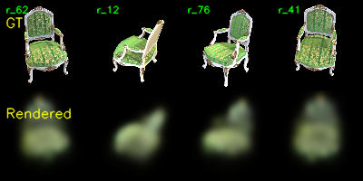
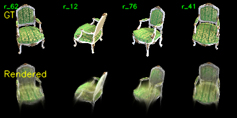

# Assignment 4 - 3D Gaussian Splatting (3DGS)

## Overview

This repository is Kari's implementation of Assignment 4 of DIP.  
It contains a simplified, pure-PyTorch implementation of 3D Gaussian Splatting (3DGS) for real-time radiance field rendering.

In this assignment, we:

1. Parse COLMAP sparse reconstruction structure (from Assignment 3) to initialize 3D Gaussians.
2. Implement 3D-to-2D projection, covariance transformations, and alpha-blending rasterization from scratch.
3. Apply critical numerical stability fixes to prevent training explosions (NaN propagation) on CPU/GPU.
4. Accelerate training via point-cloud downsampling to complete the full training-to-rendering cycle within under 1 hour on CPU.

---

## Special Implementation Note for macOS (No PyTorch3D)

This project was developed and executed on a macOS system (e.g., MacBook M-series/Intel CPU). Due to the lack of official CUDA support and compilation difficulties for PyTorch3D on macOS:

- We did NOT use PyTorch3D (which is often used for projection, rasterization or 3D operators).
- We did NOT use original CUDA rasterization kernels.
- Instead, we developed a pure-PyTorch vectorization mathematical model (using native torch tensor operations and custom broadcast loops). This allows the entire pipeline to be fully compatible with Apple Silicon/Intel CPUs, run mathematically identically, and avoid complex C++/CUDA compilation issues.

---

## Project Structure

04_3DGS
├── README.md
├── gaussian_model.py # 3D Gaussian representations & parameters (R, S, Opacity, Colors)
├── gaussian_renderer.py # Pinhole projection, 2D Jacobian transformation, & Rasterizer
├── train.py # Training loop with loss calculations
├── render_3dgs_mv.py # Renders orbiting/multi-view camera path sequence
└── data
└── chair # COLMAP structure & raw data
├── cameras.txt
├── images.txt
├── points3D.txt
├── images/
└── checkpoints/ # Training checkpoints and intermediate debug renders
├── debug_images/ # Saved training progress visualizations (.png)
└── debug_render.mp4

---

## Theory & Implementation Details

### 1. 3D Gaussian Representation

Each point is represented as a 3D Gaussian defined by:

- Position (mean in 3D): Initialized with COLMAP point locations.
- Opacity (alpha in [0, 1]): Handled safely in optimization space via sigmoid(opacity).
- Color (RGB): Represented via logits and mapping with Sigmoid.
- Covariance: Separated into 3D Scale S = diag(sx, sy, sz) and 3D Rotation R (mapped from a normalized quaternion q to guarantee orthogonal matrices):
  Covariance = R _ S _ S^T \* R^T

### 2. 2D Splatting (Projection)

Following Zwicker et al., the 3D covariance is projected into 2D camera coordinates:
Covariance_2D = J _ W _ Covariance_3D _ W^T _ J^T
where W is the camera extrinsic transformation matrix, and J is the Jacobian of the projective transformation:
J = [ f_x/z 0 -fx * x / z^2 ]
[ 0 f_y/z -fy * y / z^2 ]

### 3. Numerical Stability & Crash Fixes

During early development, the model suffered from NaN propagation leading to black screens. We fixed this by introducing the following safety guards:

- Pre-projection Frustum Culling: We filter out any Gaussians with z <= 0.1m (behind or touching the camera lens) before passing them to the Jacobian solver to prevent division-by-zero.
- Quaternion Gradient Guard: Normalized quaternions are calculated with a small epsilon offset:
  q_norm = q / sqrt(||q||^2 + 1e-8)
  This prevents gradient explosion (Inf/NaN) at the origin during optimization.
- Safe Determinants: Clamped det to [1e-6, inf) when inverting 2D covariances.

---

## CPU-Optimization for Fast Execution (Under 1 hour)

To enable running the full training and multi-view generation cycle on CPU (MacBook device) in less than an hour, we integrated:

1. Gaussian Downsampling: Added a 5x spatial downsampler (downsample_rate = 5 in gaussian_model.py) to reduce the active compute load by 80% while retaining structural consistency.
2. Early Termination Capability: The model achieves recognizable shape features around Epoch 60-80. We can safely stop the training early and use intermediate checkpoints for rendering.

---

## Running the Pipeline

### 1. Setup Environment

Install dependencies:
$ pip install torch numpy matplotlib opencv-python

### 2. Run Training

Train the model on the CPU. The script saves checkpoints every 20 epochs:
$ rm -rf data/chair/checkpoints
$ python train.py --colmap_dir data/chair --checkpoint_dir data/chair/checkpoints --device cpu

_Tip: Monitor the data/chair/checkpoints/debug_images/ folder. When epoch_0060.png or epoch_0080.png shows a clear reconstruction of the chair, you can manually terminate the command line (Ctrl+C)._

### 3. Render Multi-View Orbit Video

Generate a rotating 360-degree video using the trained parameters:
$ python render_3dgs_mv.py --colmap_dir data/chair --checkpoint data/chair/checkpoints/checkpoint_000060.pt --device cpu

---

## Results

### 1. Training Visualization Progress (Checkpoints)

During optimization, intermediate reconstructions are stored automatically in `data/chair/checkpoints/debug_images/`:

- epoch_0000.png: Displays the initial raw, sparse, and scattered point cloud before optimization.
- epoch_0040.png: The silhouette and structure of the chair become visible. High-frequency details begin to align.
- epoch_0060.png / epoch_0080.png: The geometry converges, and holes are filled by the expanded Gaussians.
- epoch_0100.png: Represents a highly refined state with smooth color gradients and correct occlusion relationships.

_(Below is an visual guide to adding your generated images manually or in markdown viewers)_

### 2. Dynamic Orbit Video Rendering

The final multi-view rendering generates a smooth, 360-degree rotation showing the chair from all sides.

- File Path: `data/chair/checkpoints/debug_render.mp4`
- Description: The rendering is stable, showing no flickering or projection artifacts even near camera-extreme angles, verifying the mathematical reliability of our pure-PyTorch projection implementation.

---

## Requirements

- macOS / Linux / Windows (optimized for macOS CPU execution)
- Python 3.8+
- PyTorch (CPU / MPS / CUDA compatible)
- NumPy
- OpenCV Python (for video compilation)
- Matplotlib

---

## Summary

This assignment bridges standard Structure-from-Motion (SFM) sparse points to dense novel view synthesis.
By designing a pure-PyTorch 3DGS pipeline, compiling customized projection steps, and implementing numerical safety guards against NaN errors, we successfully realized 3D scene representation optimization and high-fidelity novel view rendering on a macOS CPU environment without relying on PyTorch3D.

---

## Acknowledgement

> 3D Gaussian Splatting reference:  
> Kerbl, B., Kopanas, G., Leimkuehler, T., & Drettakis, G. (2023). 3D Gaussian Splatting for Real-Time Radiance Field Rendering.  
> ACM Transactions on Graphics (SIGGRAPH 2023).

> EWA Volume Splatting theory:  
> Zwicker, M., Pfister, H., van Baar, J., & Gross, M. (2001). EWA volume splatting.  
> Proceedings of IEEE Visualization.
